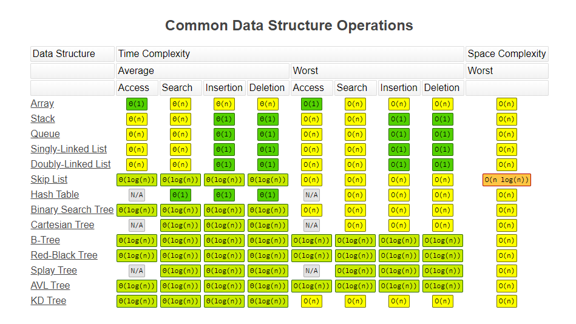
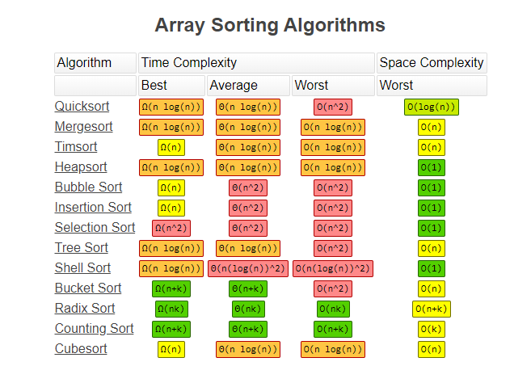

## 数据结构与算法

[各类算法时间复杂度一览](https://www.bigocheatsheet.com/)



### 线性数据结构

**数组、链表、栈、队列**

1. [数组](word/数组.md)

2. [链表](word/链表.md)

3. [栈](word/栈.md)

4. [队列](word/队列.md)

---

### 非线性数据结构

#### 树

**二叉树**

```
二叉树遍历(看根的位置)
前序：根 -> 左 -> 右
中序：左 -> 根 -> 右
后序：左 -> 右 -> 根
```

**二分搜索树**

#### 图

---

### 算法



#### [排序](word/排序/排序算法.md)

n^ 2

[1、冒泡排序](word/排序/1冒泡排序.md)

[2、插入排序](word/排序/1插入排序.md)

[3、选择排序](word/排序/1选择排序.md)


nlogn

[4、归并排序](word/排序/2归并排序.md)

[5、快速排序](word/排序/2快速排序.md)

n


[查找](word/查找.md)

- 二分查找

[动态规划](word/动态规划.md)


[递归](./递归.md)

[参考](https://lyl0724.github.io/2020/01/25/1/)


分治算法


贪心算法


深度优先搜索


广度优先搜索


回溯算法
